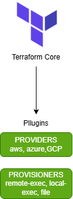
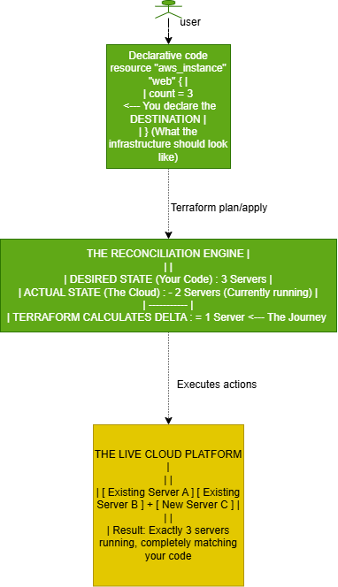
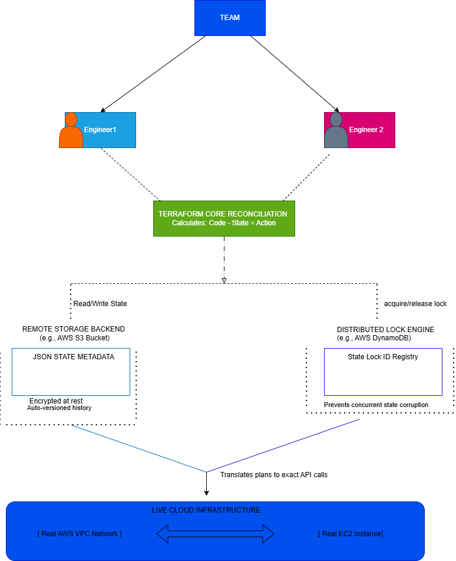

# Terraform-Project

This project is centered on Terraform as an Infrastructure as Code (IaC) tool for provisioning, managing, and automating cloud infrastructure.

Table of Contents
- [Project Overview](#project-overview)
- [What is Terraform?](#what-is-terraform)
  - [Terraform Core](#terraform-core)
  - [Providers & Provisioners](#providers--provisioners)
  - [Declarative Paradigm](#declarative-paradigm)
- [State File (.tfstate)](#state-file-tfstate)
  - [What is a Terraform State File?](#what-is-a-terraform-state-file)
  - [Benefits of State Files](#benefits-of-state-files)
  - [State File Structure](#state-file-structure)
  - [Remote State Management](#remote-state-management)
- [Security Best Practices](#security-best-practices)
  - [Protecting Secrets](#protecting-secrets)
  - [GitHub Security](#github-security)
  - [State File Security](#state-file-security)
- [Repository Structure](#repository-structure)
- [Getting Started](#getting-started)
  - [Prerequisites](#prerequisites)
  - [Installation](#installation)
  - [Quickstart](#quickstart)
- [Best Practices](#best-practices)
- [Common Commands](#common-commands)
- [Installation Guide](#installation-guide)
  - [Terraform Installation & First Run](#terraform-installation--first-run)
  - [Manual Windows Installation](#manual-windows-installation)
  - [Testing Environment Configuration](#testing-environment-configuration)
  - [Running the Test Lifecycle Workflow](#running-the-test-lifecycle-workflow)
  - [Summary & Core Takeaways](#summary--core-takeaways)
- [Contributing](#contributing)
- [License](#license)
- [Additional Resources](#additional-resources)

## Project Overview

This repository contains Terraform configuration and supporting files to demonstrate and manage cloud infrastructure using IaC principles. The goal is to provide reusable examples and best-practice pa[...]

## What is Terraform?

Terraform is an open-source Infrastructure as Code (IaC) tool that enables engineers to provision, manage, and automate infrastructure using code rather than manual processes. Developed by HashiCorp, [...]

Before tools like Terraform became popular, cloud infrastructure was often created manually through web consoles. For example, deploying a web application on a cloud platform might involve creating VM[...]

Terraform by HashiCorp stands as the industry standard for open-source Infrastructure as Code. It provides engineers with the ability to define, provision, and iterate multi-cloud infrastructure safel[...]

### Terraform Core

Terraform Core is the main engine of Terraform. It is responsible for:
- Reading and parsing Terraform configuration files
- Understanding what infrastructure you want to create
- Determining what changes are needed (plan phase)
- Applying those changes to your infrastructure (apply phase)
- Managing the state of your infrastructure

Terraform Core communicates with cloud provider APIs through a plugin-based architecture, making it agnostic to the underlying infrastructure provider.

### Plugins (Providers and Provisioners)

Terraform Core does not inherently know how an AWS EC2 instance, a Google Cloud storage bucket, or a Kubernetes cluster works. Instead, it relies on Providers.

- **What they are:** Providers are executable binaries that act as translation bridges between Terraform Core and target platform APIs.
- **How they work:** When Core decides it needs to create an AWS server, it asks the AWS Provider plugin via an RPC (Remote Procedure Call) interface. The provider translates that request into actual [...]
- **Extensibility:** Because of this decoupled layout, anyone can write a provider for any service that features a public API.

**Common Providers:**
- `aws` - Amazon Web Services
- `google` - Google Cloud Platform
- `azurerm` - Microsoft Azure
- `kubernetes` - Kubernetes
- `docker` - Docker containers
- `postgresql` - PostgreSQL databases



### Declarative Paradigm

When you write a Terraform configuration file, you are defining a target blueprint:

```hcl
resource "aws_instance" "web_server" {
  ami           = "ami-0c55b159cbfafe1f0"
  instance_type = "t2.micro"
  count         = 3
}
```

If you deploy this code, Terraform calculates dynamically:
- **On first deploy:** Terraform sees you want 3 servers, checks your cloud provider, finds 0 servers, and deploys 3.
- **On scaling:** If you change `count = 3` to `count = 5`, Terraform only creates 2 new servers (not all 5).
- **On modification:** If you change the instance type from `t2.micro` to `t2.large`, you don't write a script to modify servers. Terraform handles the changes automatically.
- **On deletion:** If you change `count = 5` to `count = 0`, Terraform destroys all 5 servers.

Terraform is also self-healing: If an engineer manually logs into the AWS Web Console and deletes one of your three servers, your infrastructure has "drifted." The next time you run `terraform plan`, [...]

In summary, Terraform is declarative because you describe what you want the final infrastructure to look like, not how to build it step by step.



---

## State File (.tfstate)

### What is a Terraform State File?

The Terraform state file (`.tfstate`) is a critical component that stores metadata about your infrastructure. It is a JSON file that contains:

- **Resource IDs:** Unique identifiers assigned by your cloud provider (e.g., AWS instance IDs)
- **Resource Attributes:** Current configuration of each resource
- **Dependencies:** Relationships between resources
- **Sensitive Data:** Database passwords, API keys, and other secrets (in plaintext by default)

**Example State File Structure:**
```json
{
  "version": 4,
  "terraform_version": "1.0.0",
  "serial": 42,
  "lineage": "unique-id",
  "outputs": {},
  "resources": [
    {
      "type": "aws_instance",
      "name": "web_server",
      "instances": [
        {
          "schema_version": 1,
          "attributes": {
            "id": "i-1234567890abcdef0",
            "ami": "ami-0c55b159cbfafe1f0",
            "instance_type": "t2.micro",
            "key_name": "my-key",
            "private_ip": "10.0.1.10",
            "public_ip": "54.123.45.67"
          }
        }
      ]
    }
  ]
}
```

### Benefits of State Files

1. **Performance Optimization:**
   - Avoids querying all resources on every `terraform plan` or `terraform apply`
   - Significantly speeds up operations on large infrastructure deployments
   - Caches resource metadata locally or remotely

2. **Accurate Change Detection:**
   - Compares desired state (configuration) with actual state (real infrastructure)
   - Only plans changes for modified resources
   - Prevents unnecessary API calls and resource recreation

3. **Dependency Tracking:**
   - Stores explicit and implicit dependencies between resources
   - Ensures resources are created/destroyed in correct order
   - Example: A security group must exist before an EC2 instance can reference it

4. **Infrastructure Metadata:**
   - Maintains a record of what infrastructure exists
   - Stores resource IDs that link Terraform configurations to actual cloud resources
   - Enables resource identification for updates or deletion

5. **Team Collaboration:**
   - When using remote state, enables multiple team members to work on the same infrastructure
   - Prevents concurrent modifications that could cause conflicts
   - Provides a single source of truth for infrastructure state

6. **Disaster Recovery:**
   - State file serves as a backup of infrastructure configuration
   - Can be used to recreate infrastructure if cloud resources are accidentally deleted
   - Enables infrastructure version history when stored in version control systems

7. **Multi-Environment Management:**
   - Separate state files for development, staging, and production
   - Clear isolation between environments
   - Prevents accidental changes to production infrastructure

### State File Structure

**Key Components:**

- **version:** Terraform state file format version
- **terraform_version:** Version of Terraform that created the state
- **serial:** Increments with each state modification
- **lineage:** Unique identifier linking state file versions
- **outputs:** Output values defined in your configuration
- **resources:** All managed resources and their current attributes

### Remote State Management

**Local State (Not Recommended for Teams):**
```hcl
# Default - stores state in terraform.tfstate
terraform {
  required_version = ">= 1.0"
}
```

**Remote State with S3 (AWS):**
```hcl
terraform {
  backend "s3" {
    bucket         = "my-terraform-state"
    key            = "prod/terraform.tfstate"
    region         = "us-east-1"
    encrypt        = true
    dynamodb_table = "terraform-locks"
  }
}
```

**Benefits of Remote State:**
- ✅ Centralized state management
- ✅ Automatic backups
- ✅ State locking (prevents concurrent modifications)
- ✅ Team accessibility
- ✅ Better security options (encryption at rest and in transit)
- ✅ Integration with CI/CD pipelines



---

## Security Best Practices

### Protecting Secrets

**Problem:** Terraform state files contain sensitive data in plaintext by default (passwords, API keys, tokens).

#### 1. **Use `.gitignore` to Exclude State Files**

Create a `.gitignore` file in your repository root:

```bash
# Terraform state files
*.tfstate
*.tfstate.*
.terraform.lock.hcl
.terraform/

# Local environment files
.env
.env.local
*.tfvars
!example.tfvars

# IDE
.vscode/
.idea/
*.swp
*.swo
*~
```

**Add to your repository:**
```bash
git add .gitignore
git commit -m "Add .gitignore to protect sensitive files"
```

#### 2. **Use Terraform Variables and `.tfvars` Files**

Define variables in your Terraform configuration:

```hcl
# main.tf
variable "database_password" {
  type        = string
  sensitive   = true
  description = "Database password (marked as sensitive)"
}

variable "api_key" {
  type        = string
  sensitive   = true
  description = "Third-party API key"
}

resource "aws_db_instance" "example" {
  master_password = var.database_password
  # ... other configuration
}
```

Create a local `.tfvars` file (NOT committed):

```hcl
# terraform.tfvars (in .gitignore)
database_password = "super-secret-password-123"
api_key           = "sk-1234567890abcdef"
```

Create an example file for documentation:

```hcl
# terraform.tfvars.example
database_password = "change-me"
api_key           = "change-me"
```

**Pass variables via command line (for CI/CD):**
```bash
terraform apply \
  -var="database_password=$DB_PASSWORD" \
  -var="api_key=$API_KEY"
```

#### 3. **Use Environment Variables**

Set variables using environment variables prefixed with `TF_VAR_`:

```bash
export TF_VAR_database_password="super-secret-password"
export TF_VAR_api_key="sk-1234567890abcdef"
terraform apply
```

#### 4. **Use AWS Secrets Manager or HashiCorp Vault**

Retrieve secrets dynamically during Terraform execution:

```hcl
# Using AWS Secrets Manager
data "aws_secretsmanager_secret_version" "db_password" {
  secret_id = "prod/database/password"
}

resource "aws_db_instance" "example" {
  master_password = data.aws_secretsmanager_secret_version.db_password.secret_string
}
```

#### 5. **Mark Sensitive Variables**

Use the `sensitive = true` attribute to prevent values from appearing in logs:

```hcl
variable "db_password" {
  type      = string
  sensitive = true  # Prevents output from being displayed
}

output "db_connection" {
  value     = aws_db_instance.example.endpoint
  sensitive = false  # Safe to display
}
```

### GitHub Security

#### 1. **Enable Secret Scanning**

GitHub automatically scans for exposed secrets:

- Go to **Repository Settings → Security & analysis**
- Enable "Secret scanning"
- Enable "Push protection" to block pushes with exposed secrets

#### 2. **Use GitHub Secrets for CI/CD**

Store sensitive values in GitHub Actions secrets:

```yaml
# .github/workflows/terraform.yml
name: Terraform Apply

on:
  push:
    branches: [main]

jobs:
  terraform:
    runs-on: ubuntu-latest
    steps:
      - uses: actions/checkout@v3
      
      - uses: hashicorp/setup-terraform@v2
      
      - name: Terraform Apply
        env:
          TF_VAR_database_password: ${{ secrets.DB_PASSWORD }}
          TF_VAR_api_key: ${{ secrets.API_KEY }}
          AWS_ACCESS_KEY_ID: ${{ secrets.AWS_ACCESS_KEY_ID }}
          AWS_SECRET_ACCESS_KEY: ${{ secrets.AWS_SECRET_ACCESS_KEY }}
        run: |
          terraform init
          terraform plan
          terraform apply -auto-approve
```

#### 3. **Implement Branch Protection Rules**

Prevent direct pushes to main branches:

- Go to **Settings → Branches → Add rule**
- Require pull request reviews before merging
- Require status checks to pass
- Dismiss stale review approvals

#### 4. **Use Deploy Keys for Read-Only Access**

For CI/CD systems that need to clone your repo:

```bash
# Generate a deploy key (no passphrase for CI/CD)
ssh-keygen -t ed25519 -f deploy_key -N ""

# Add public key to repo: Settings → Deploy Keys
# Add private key to CI/CD system secrets
```

### State File Security

#### 1. **Enable State Encryption**

**For S3 Backend:**
```hcl
terraform {
  backend "s3" {
    bucket         = "my-terraform-state"
    key            = "prod/terraform.tfstate"
    region         = "us-east-1"
    encrypt        = true              # Enables SSE-S3 encryption
    dynamodb_table = "terraform-locks" # State locking
  }
}
```

**Enable versioning and MFA delete:**
```bash
# On S3 bucket
aws s3api put-bucket-versioning \
  --bucket my-terraform-state \
  --versioning-configuration Status=Enabled

# Block public access
aws s3api put-public-access-block \
  --bucket my-terraform-state \
  --public-access-block-configuration \
  "BlockPublicAcls=true,IgnorePublicAcls=true,BlockPublicPolicy=true,RestrictPublicBuckets=true"
```

#### 2. **Implement State Locking**

Prevent concurrent modifications:

```hcl
terraform {
  backend "s3" {
    bucket         = "my-terraform-state"
    dynamodb_table = "terraform-locks"
    # DynamoDB table manages state locks automatically
  }
}
```

#### 3. **Restrict State Access**

**IAM Policy for State Access:**
```json
{
  "Version": "2012-10-17",
  "Statement": [
    {
      "Effect": "Allow",
      "Principal": {
        "AWS": "arn:aws:iam::ACCOUNT-ID:role/TerraformRole"
      },
      "Action": "s3:*",
      "Resource": [
        "arn:aws:s3:::my-terraform-state",
        "arn:aws:s3:::my-terraform-state/*"
      ]
    }
  ]
}
```

#### 4. **Never Commit State Files**

Ensure state files are in `.gitignore`:

```bash
# .gitignore
terraform.tfstate
terraform.tfstate.*
.terraform/
```

#### 5. **Regular Backups**

Enable S3 versioning and set up backup policies:

```bash
# Enable S3 replication for disaster recovery
aws s3api put-bucket-replication \
  --bucket my-terraform-state \
  --replication-configuration file://replication.json
```

---

## Complete Security Checklist

- [ ] Add `terraform.tfstate*` and `.tfvars` to `.gitignore`
- [ ] Use `terraform.tfvars.example` as a template
- [ ] Mark all sensitive variables with `sensitive = true`
- [ ] Use remote state backend (S3, Azure Storage, etc.)
- [ ] Enable encryption for remote state
- [ ] Enable state locking with DynamoDB
- [ ] Set up IAM policies restricting state access
- [ ] Enable GitHub secret scanning
- [ ] Configure GitHub branch protections
- [ ] Use GitHub Secrets for CI/CD credentials
- [ ] Never hardcode credentials in Terraform files
- [ ] Review git history for accidentally committed secrets
- [ ] Use environment variables or Vault for sensitive data
- [ ] Implement audit logging for state access
- [ ] Regularly rotate credentials and API keys

---

## Repository Structure

```
Terraform-Project/
├── main.tf                    # Primary resource definitions
├── variables.tf               # Variable declarations
├── outputs.tf                 # Output values
├── terraform.tfvars.example   # Example variables template
├── .gitignore                 # Files to exclude from git
├── .github/
│   └── workflows/
│       └── terraform.yml      # CI/CD pipeline
├── modules/                   # Reusable Terraform modules
│   ├── networking/
│   ├── compute/
│   └── database/
├── environments/              # Environment-specific configs
│   ├── dev/
│   ├── staging/
│   └── prod/
└── README.md                  # This file
```

---

## Getting Started

### Prerequisites

- **Terraform >= 1.0** - Download from [terraform.io](https://www.terraform.io/downloads.html)
- **AWS CLI** - For AWS provider usage
- **Git** - For version control
- **Make** (optional) - For running Makefile commands

### Installation

```bash
# Verify Terraform installation
terraform version

# Clone this repository
git clone https://github.com/mustapha641/Terraform-Project.git
cd Terraform-Project
```

### Quickstart

1. **Initialize Terraform:**
```bash
terraform init
```

2. **Create your variables file:**
```bash
cp terraform.tfvars.example terraform.tfvars
# Edit terraform.tfvars with your values
```

3. **Review the execution plan:**
```bash
terraform plan
```

4. **Apply the configuration:**
```bash
terraform apply
```

5. **Destroy resources (when done):**
```bash
terraform destroy
```

---

## Best Practices

1. **Always use version control** - Track all infrastructure changes
2. **Keep state files secure** - Use remote backends with encryption
3. **Use modules for reusability** - Keep configurations DRY (Don't Repeat Yourself)
4. **Implement code review** - Require pull requests for infrastructure changes
5. **Use consistent naming conventions** - Makes code maintainable
6. **Document your resources** - Add descriptions to variables and outputs
7. **Test in non-production first** - Validate changes in dev/staging before prod
8. **Implement state locking** - Prevents concurrent modifications
9. **Use workspaces for environments** - Separate dev, staging, and production
10. **Monitor infrastructure changes** - Integrate with audit logging and notifications

---

## Common Commands

```bash
# Format and validate code
terraform fmt
terraform validate

# Plan and apply with targets
terraform plan -target=aws_instance.web_server
terraform apply -target=aws_instance.web_server

# Import existing resources
terraform import aws_instance.example i-1234567890abcdef0

# Show current state
terraform show

# List resources in state
terraform state list

# Show specific resource
terraform state show aws_instance.web_server
```

---

## Installation Guide

### Terraform Installation & First Run

Terraform is completely cross-platform and distributed as a single lightweight binary. To write code, we use VS Code, but to actually build infrastructure, we need the underlying CLI engine.

### Manual Windows Installation

**Step 1: File Deployment**

Go to the official HashiCorp Developer platform. Download the Windows AMD64 ZIP, extract it, and place terraform.exe into a clean dedicated folder like `C:\Terraform`.

**Step 2: Environment Registration**

Search your Windows toolbar for "Environment Variables". Edit the system Path variable and add `C:\Terraform` to the registry array.

**Step 3: Verification**

Launch a completely fresh terminal window (PowerShell or Command Prompt) and test the execution path:

```bash
terraform -version
```

If you use a package manager like winget or Homebrew, the environment variables are handled for you automatically. If you choose the manual file method, remembering to append the binary folder locatio[...]

### Testing Environment Configuration

Once the terminal acknowledges our binary version, we initialize our project layout. We do this by launching VS Code, opening a blank project workspace directory, and adding a main.tf script file.

Create a file named `main.tf` and paste the following clean provider test layout (this operates completely locally without requiring cloud account credentials or incurring costs):

```hcl
# 1. Define required provider engines
terraform {
  required_providers {
    local = {
      source  = "hashicorp/local"
      version = "~> 2.0"
    }
  }
}

# 2. Declare a local asset generation task
resource "local_file" "presentation_test" {
  filename = "${path.module}/terraform_success.txt"
  content  = "Terraform CLI execution lifecycle tested successfully on 2026!"
}
```

### Running the Test Lifecycle Workflow

Open the integrated VS Code terminal and execute these 3 core sequential commands:

**1. terraform init**

Command 1: Core scans your main.tf code block, maps the local provider block, and pulls down the required plugin binaries directly from the HashiCorp registry into a local hidden cache folder.

**2. terraform plan**

Command 2: Runs a simulation against your machine's filesystem. It outputs a logical roadmap detailing exactly what changes will take place—showing that it intends to add (+) exactly one local_file [...]

**3. terraform apply**

Command 3: Executes live modifications. Type yes when prompted. The internal engine compiles the declarative block, instructs the local provider plugin to process the task, and generates the terraform[...]

### Summary & Core Takeaways

- **Decoupled Architecture Works:** The core engine acts as a general manager, while independent plugins handle target ecosystem tasks.

- **Declarative Consistency:** We only describe the target artifact endpoint configuration (local_file), leaving execution steps to the system loop.

- **Next Steps:** Now that local environment workflows work smoothly, the same engine commands map cleanly to cloud providers like AWS, Azure, and Google Cloud by simply swapping out the provider bloc[...]

---

## Contributing

Contributions are welcome! Please:

1. Fork the repository
2. Create a feature branch (`git checkout -b feature/your-feature`)
3. Commit changes (`git commit -am 'Add new feature'`)
4. Push to branch (`git push origin feature/your-feature`)
5. Create a Pull Request

---

## Security Reminders

⚠️ **CRITICAL:**
- **NEVER commit `terraform.tfstate` files** to version control
- **NEVER hardcode secrets** in Terraform files
- **ALWAYS use `.gitignore`** to exclude sensitive files
- **ALWAYS enable encryption** for remote state
- **ALWAYS use IAM roles** instead of access keys when possible
- **REGULARLY audit** your Git history for exposed secrets

If you accidentally commit secrets:
```bash
# Remove from Git history (use BFG Repo-Cleaner or git-filter-branch)
git filter-branch --tree-filter 'rm -f terraform.tfstate' HEAD
```

---

## License

This project is licensed under the MIT License - see LICENSE file for details.

---

## Additional Resources

- [Terraform Official Documentation](https://www.terraform.io/docs)
- [AWS Provider Documentation](https://registry.terraform.io/providers/hashicorp/aws/latest/docs)
- [Terraform Best Practices](https://www.terraform.io/docs/cloud/guides/recommended-practices.html)
- [HashiCorp Security Best Practices](https://www.hashicorp.com/resources/terraform-security-best-practices)

---

**Last Updated:** July 2026
**Maintainer:** mustapha641
